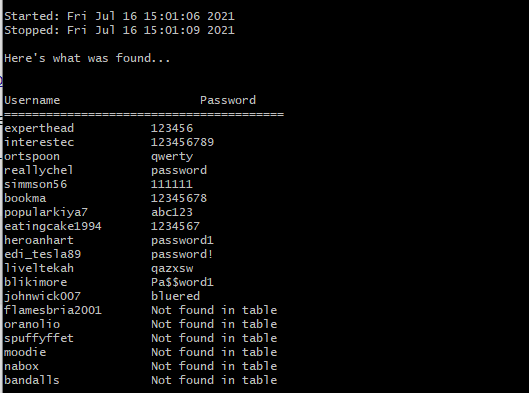

# MD5pass-crack-py
Created for TheForage/Goldman Sachs Engineering Virtual Program 

# How does this work?
1) Companies will usually store their user information in a database, where the username will be in plain-text, but passwords should be encrypted.
2) This project imagines a 'cracked database' where the leaked information is stored in a .txt file, each line having a format like: username:password_hash
3) Passwords in a database are "hashed"
    - Converted into a 'secret' combination of letters and numbers (i.e. the MD5 hash of "password" would be: 5f4dcc3b5aa765d61d8327deb882cf99)
4) Since the hashes in MD5 don't change, we can keep a long list of previously uncovered passwords. In our case, this is [rockyou.txt](rockyou.txt)
5) For each hash in our leaked database, we see if it exists in our long list of plain-text passwords in hashed form.
6) Then, we can match the decrypted hash to the username and get a valid output.

# Tutorial
- In addition to cloning this repo, you must also have: 
1) the [hashcat-6.2.2](https://hashcat.net/hashcat/) folder (download the "hashcat binaries" download)
2) [rockyou.txt](https://github.com/brannondorsey/naive-hashcat/releases/download/data/rockyou.txt)

both in the same directory as main.py

# To run:
- Open a terminal in the directory of main.py (either right-click 'Git Bash Here' or 'dir'/'cd' yourself to it)
- python main.py
- enter filenames as:
-    rockyou.txt
-    originalfile.txt

Note: parsed_hashes.txt will be written to the same directory, this is an output containing a list of all the hashes in the [input file](originalfile.txt).

# Updated Output:

# Walkthrough:
## (before indexing fix)

